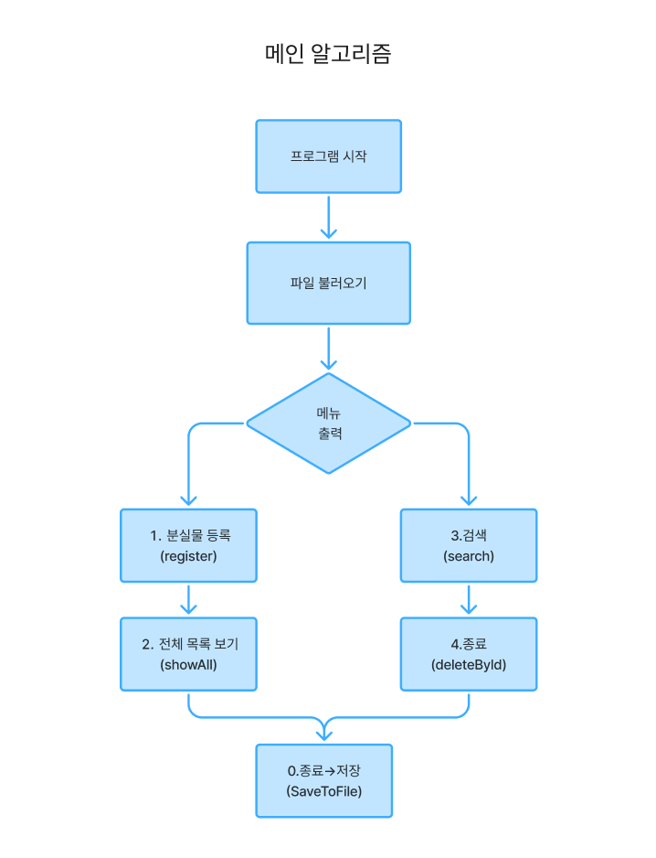

# 유실물 통합 관리 시스템 개발 보고서

2024011901 한다영 

---

## 1. 프로젝트 개요

- **제목**: 유실물 통합 관리 시스템
- **개요**: 대학교 내의 불편한 유실물 찾기 및 관리 작업을 파일 입/출력 구조로 구현한 프로그램
- **개발 환경**: Java (IntelliJ)
- **단위**: 청주대학교 학생 및 교직원

---

## 2. 디렉터리 구조

```
LostFoundApp/
├─ src/
│   ├─ Main.java
│   ├─ LostItem.java
│   └─ LostItemManager.java
└─ data/
    └─ lost_items.txt

```

---

## 3. 각 클래스 및 메서드 설명

### 1) `LostItem.java`

유실물의 형태가 되는 객체 class이며 단순한 구조 및 `toString()` 메서드를 가지고 있습니다.

- **클래스별 단위 변수**: id, name, place, date, contact
- **메서드**:
    - `LostItem(...)`: 유실물 생성 자료 입력
    - `getId()`: ID 및 구현 위한 값 획득
    - `toString()`: 현황 포맷으로 나타내기
    

### 2) `LostItemManager.java`

유실물 목록을 관리하는 관리자 class. 테스트에서 구성한 메서드 회원 정보와 연결됩니다.

- **메서드**:
    - `register(String, String, String, String)` : 유실물 각 항목 입력 발생
    - `showAll()` : 목록 전체 보기
    - `search(String)` : 키워드로 검색
    - `deleteById(int)` : ID를 입력받아 목록에서 삭제
    - `saveToFile(String)` / `loadFromFile(String)` : 파일 저장 및 로드
    - `getItems()` : 테스트에서 items 및 목록 획득을 위해 구현
    

### 3) `Main.java`

사용자 입력을 받아 전체 프로그램을 제어하는 메인 클래스 입니다

- 메뉴 번호(1~4, 0)를 입력 받아 등록, 전체 목록 보기, 검색, 삭제 기능 중 하나를 실행합니다
- 0 입력 시 저장 및 프로그램 종료

---

## 4. 주요 기능

- **유실물 등록** : 유실물 정보를 받아서 새로 목록에 추가해주는 메서드

```java
public void register(String name, String location, String date, String contact) {
    LostItem item = new LostItem(nextId++, name, location, date, contact);
    itemList.add(item);
}
```

- **목록 보기** : 지금까지 등록된 유실물 목록을 다 보여줌

```java
public List<LostItem> showAll() {
    return itemList;
}
```

- **검색** : 이름이나 장소에 키워드가 들어있는 유실물을 찾아서 보여줌
    - `"우산"`을 검색하면, 이름이 우산이거나 장소에 우산이 들어간 항목이 다 나옴

```java
public List<LostItem> search(String keyword) {
    return itemList.stream()
        .filter(item -> item.getName().contains(keyword) || item.getLocation().contains(keyword))
        .collect(Collectors.toList());
}

```

- **삭제** : 특정 번호(id)를 가진 유실물을 목록에서 제거해줌
    - `deleteById(3)` 를 하면 3번 유실물이 삭제됨

```java
public boolean deleteById(int id) {
    return itemList.removeIf(item -> item.getId() == id);
}

```

- **저장** : 유실물 목록을 파일에 저장해서 껐다 켜도 유지되게 해줌
    - 데이터베이스는 안 쓰고 `.txt` 파일에 기록하는 방식
    - 쉼표로 나눠서 저장하는 건 **CSV**(콤마로 구분된 텍스트) 형식

```java
public void saveToFile(String filename) throws IOException {
    BufferedWriter writer = new BufferedWriter(new FileWriter(filename));
    for (LostItem item : itemList) {
        writer.write(item.getId() + "," + item.getName() + "," + item.getLocation() + "," +
                     item.getDate() + "," + item.getContact());
        writer.newLine();
    }
    writer.close();
}
```

- **불러오기**: 저장해둔 파일을 읽어서 유실물 목록에 다시 불러오는 기능
    - `itemList.clear()`는 기존 데이터를 다 지우고 새로 불러오기 위한 준비
    - `nextId`를 조정해서 ID가 겹치지 않게

```java
public void loadFromFile(String filename) throws IOException {
    BufferedReader reader = new BufferedReader(new FileReader(filename));
    itemList.clear();  // 기존 목록 제거
    String line;
    while ((line = reader.readLine()) != null) {
        String[] parts = line.split(",");
        int id = Integer.parseInt(parts[0]);
        LostItem item = new LostItem(id, parts[1], parts[2], parts[3], parts[4]);
        itemList.add(item);
        nextId = Math.max(nextId, id + 1);  // ID 중복 방지
    }
    reader.close();
}

```

---

## 5. 전체 프로그램 동작 환경(순서도)



---

## 6. 기능별 상세 순서도

- **유실물 등록**: `register()`


- **검색**: `search()`


- **삭제**: `deleteById()`


---

## 7. JUnit 테스트 결과

JUnit을 활용하여 본 시스템의 핵심 기능들이 정상적으로 작동하는지 테스트를 진행하였다.

각 테스트는 사전에 준비된 샘플 데이터를 기반으로 수행되었으며 결과는 모두 성공(PASSED) 하였다.

- 테스트 명령:
    - `testRegisterAndShowAll()` : 유실물 1건 등록 후 전체 목록 출력 확인
    - `testSearchFound()` : 특정 키워드 (예:”지갑”)로 유실물 검색
    - `testDeleteById()` : ID 유실물 삭제 후 목록 검증
    - `testSaveAndLoad()` :목록 저장 후 다시 불러와서 일치 여부 확인

---

## 8. 느낀점 및 성찰

이번 유실물 통합 관리 시스템 프로젝트를 통해 단순한 CRUD 기능 구현을 넘어서 프로그램 전체 흐름을 설계하고 관리하는 과정의 중요성을 체감할 수 있었다.

특히 객체지향적으로 클래스를 나누고 각 역할에 따라 책임을 분리하면서 효율적이고 유지보수 가능한 구조가 얼마나 중요한지 배울 수 있었고 파일 입출력 기능을 통해 단순한 실행형 코드가 아닌 영속적인 데이터 저장 방식을 구현해봄으로써 프로그램의 완성도를 높이는 경험을 할 수 있었다.

개발 과정에서 가장 도움이 되었던 부분은 작성한 기능이 의도한 대로 동작하는지 명확히 확인할 수 있고 이 과정에서 테스트의 중요성을 몸소 느낄 수 있도록  JUnit 테스트를 통해 기능을 검증한 경험이였다고 생각한다. 향후에는 예외 처리나 비정상 입력에 대한 테스트도 함께 포함하여 보다 견고한 시스템을 만들어 보고싶다.

아쉬웠던 점은 초기에 전체 구조를 세밀하게 설계하지 못해 구현 도중 몇 차례 코드를 수정해야 했던 점이였다. 다음 프로젝트에서는 먼저 기능 흐름도와 클래스 다이어그램 등을 먼저 설계한 뒤 개발에 들어가는 습관을 기를 것이다

이번 프로젝트는 단순한 기능 구현을 넘어 기획부터 개발, 테스트, 보고서 작성까지 전 과정을 경험해본 값진 기회였으며 이를 통해 전공자로서의 기본 역량을 한층 더 키울 수 있었다고 생각한다.